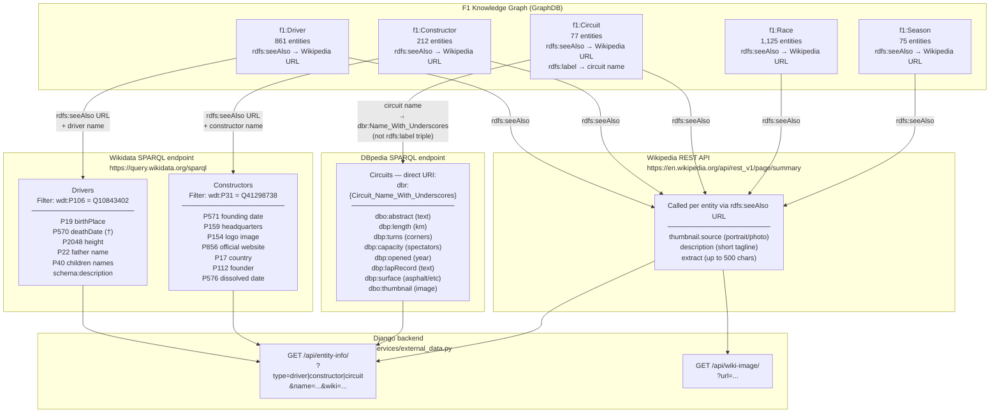

# External Knowledge Integration

Shows how the F1 knowledge graph is enriched at render time from three external sources. All calls are asynchronous (client-side JS fetch after page load) with in-process caching on the Django server.

## What is Currently Enriched

| Entity | Wikipedia | Wikidata | DBpedia |
|--------|-----------|----------|---------|
| Driver | ✅ photo + extract | ✅ birthPlace, death†, height, family | — |
| Constructor | ✅ photo + extract | ✅ logo, founder, website, country, dissolved | — |
| Circuit | ✅ photo + extract | — | ✅ turns, capacity, opened, surface, lap record |
| Race | ✅ extract (planned) | — | — |
| Season | ✅ extract (planned) | — | — |

## Key Design Decisions

| Decision | Reason |
|---|---|
| Async JS fetch (not server-side render) | Keeps TTFB fast; external APIs add 2–12s latency |
| In-process `_cache` dict | Prevents duplicate calls for the same entity within a request |
| Direct DBpedia URI construction | F1 circuits not typed as `dbo:RaceTrack` — label queries return 0 results |
| Wikipedia REST `/page/summary` | Returns structured JSON (thumbnail URL, tagline, extract) in one request |
| 12s timeout per SPARQL query | Prevents page hang if Wikidata/DBpedia is slow or rate-limited |
