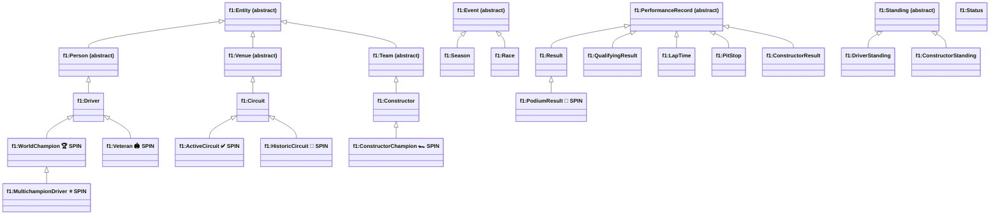

# Ontology Overview — High-Level

Shows the 7 top-level abstract classes, the 13 concrete asserted classes, and the 7 SPIN-inferred subclasses. Disjointness axioms and key object properties are omitted for clarity; see the focused diagrams for those.

**Legend:** Classes labelled `SPIN` are not asserted in the facts file. They are materialised at runtime by SPIN rules in `championship/spin_rules.py`. Classes in the first two tiers are asserted or OWL-Max-inferred at GraphDB import time.
