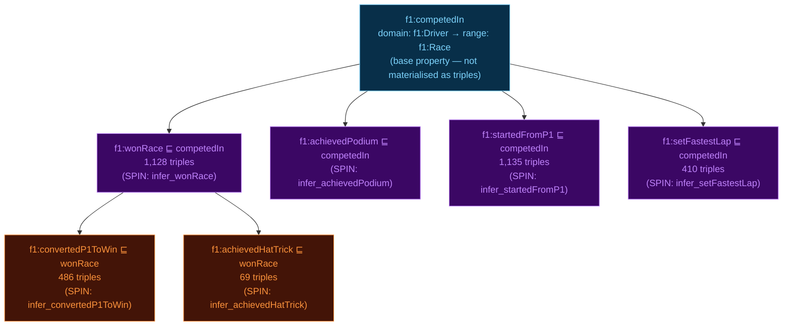

# Property Hierarchy and Key OWL Axioms

## rdfs:subPropertyOf Chain

Shows how the six SPIN-materialised properties form a hierarchy under `f1:competedIn` via `rdfs:subPropertyOf`. SPARQL property path queries against `f1:competedIn` automatically include all sub-properties.



**SPARQL property path example** — retrieves all race involvement facts for a driver through the property hierarchy:
```sparql
SELECT DISTINCT ?race WHERE {
  <http://example.org/resource/driver/hamilton>
    (f1:competedIn | f1:wonRace | f1:startedFromP1 |
     f1:convertedP1ToWin | f1:achievedHatTrick) ?race .
}
```

## Key OWL Axioms

### owl:FunctionalProperty (6 declarations)

| Property | Constraint | Meaning |
|---|---|---|
| `f1:race` | FunctionalProperty | Each Result is about exactly one Race |
| `f1:driver` | FunctionalProperty | Each Result belongs to exactly one Driver |
| `f1:circuit` | FunctionalProperty | Each Race is held at exactly one Circuit |
| `f1:status` | FunctionalProperty | Each Result has exactly one Status |
| `f1:season` | FunctionalProperty | Each Race belongs to exactly one Season |
| `f1:heldAt` | FunctionalProperty | Materialised equivalent of f1:circuit (SPIN) |

### owl:SymmetricProperty

`f1:wasTeammate` — if driver A was a teammate of B, then B was a teammate of A. This allows the SPIN rule to insert only one direction and have the reasoner infer the other:
```sparql
INSERT { ?d1 f1:wasTeammate ?d2 . ?d2 f1:wasTeammate ?d1 . }
```
In practice the SPIN rule inserts both directions explicitly for materialisation; the ontology declaration ensures HermiT validates the symmetry.

### owl:inverseOf

`f1:hadDriver owl:inverseOf f1:drovFor`

`f1:drovFor` is SPIN-materialised (driver → constructor). GraphDB OWL-Max then infers `f1:hadDriver` (constructor → driver) at import time, so the Django view can query `?constructor f1:hadDriver ?driver` without a separate SPIN rule.

### owl:disjointWith (7 pairs)

```
f1:Driver       ≠ f1:Constructor
f1:Driver       ≠ f1:Circuit
f1:Circuit      ≠ f1:Constructor
f1:Race         ≠ f1:Season
f1:Race         ≠ f1:Driver
f1:Result       ≠ f1:QualifyingResult
f1:Result       ≠ f1:LapTime
```

These axioms protect against accidental cross-type inference (e.g., a Race entity being classified as a Season because both have `f1:year`) and are verified by HermiT during ontology validation.

### owl:maxCardinality restriction

`f1:Race rdfs:subClassOf [ owl:onProperty f1:circuit ; owl:maxCardinality "1"^^xsd:integer ]`

Enforces that each Race is held at most at one Circuit. Combined with `owl:FunctionalProperty` on `f1:circuit`, this prevents data errors from being silently ignored.
