# SPIN Inference Chain

Shows how raw CSV data flows through 19 SPIN rules to produce materialised facts and entity classifications. Arrow labels show the rule name; dashed arrows show OWL-Max inference at import time.

> **Accuracy note:** classify_Veteran, classify_ActiveCircuit and classify_HistoricCircuit consume ALL result/race data — not just position-1 results. infer_drovFor reads any result linking a driver to a constructor.

```mermaid
flowchart TD
    subgraph CSV["Raw Data (Ergast CSV → N-Triples)"]
        direction LR
        A1["positionOrder = 1\n(f1:Result)"]
        A2["positionOrder ≤ 3\n(f1:Result)"]
        A3["grid = 1\n(f1:Result)"]
        A4["rank = 1\n(f1:Result)"]
        A5["position = 1\n(f1:DriverStanding)"]
        A6["position = 1\n(f1:ConstructorStanding)"]
        A7["same race + constructor\n(two distinct drivers)"]
        A8["any f1:Result\n(driver + constructor)"]
        A9["any f1:Race\n(f1:circuit FK)"]
        A10["all f1:Result rows\n(any positionOrder)"]
        A11["all race years\n(f1:year on Race)"]
    end

    subgraph OWL["OWL-Max (at GraphDB import time)"]
        O1["rdf:type f1:Driver\n(rdfs:domain driverRef)"]
        O2["rdf:type f1:Constructor\n(rdfs:domain constructorRef)"]
        O3["rdf:type f1:Circuit\n(rdfs:domain circuitRef)"]
        O4["f1:hadDriver\n(owl:inverseOf drovFor)"]
    end

    subgraph L1["Layer 1 — Race Facts (SPIN rules 1–8)"]
        B1["f1:wonRace\n1,128 triples"]
        B2["f1:achievedPodium\n(positionOrder ≤ 3)"]
        B3["f1:startedFromP1\n1,135 triples"]
        B4["f1:setFastestLap\n410 triples"]
        B5["f1:drovFor\n2,150 triples"]
        B6["f1:wasTeammate\n10,012 triples\n(SymmetricProperty)"]
        B7["f1:heldAt\n1,125 triples\n(Race → Circuit)"]
    end

    subgraph L2["Layer 2 — Combined Facts + Championships (SPIN rules 9–12)"]
        C1["f1:convertedP1ToWin\n486 triples"]
        C2["f1:achievedHatTrick\n69 triples"]
        C3["f1:wonChampionship\n75 triples\n(GROUP BY + MAX round)"]
        C4["f1:wonConstructorChampionship\n17 triples"]
        C5["rdf:Statement nodes × 75\n(annotated with f1:finalPoints)"]
    end

    subgraph L3["Layer 3 — Classifications (SPIN rules 13–19)"]
        D1["rdf:type f1:WorldChampion\n34 drivers"]
        D2["rdf:type f1:MultichampionDriver\n17 drivers\n(COUNT ≥ 2)"]
        D3["rdf:type f1:Veteran\n86 drivers\n(COUNT all results ≥ 100)"]
        D4["rdf:type f1:PodiumResult\n3,397 results"]
        D5["rdf:type f1:ActiveCircuit\n24 circuits\n(race in MAX year)"]
        D6["rdf:type f1:HistoricCircuit\n45 circuits\n(no race in last 10 yrs)"]
        D7["rdf:type f1:ConstructorChampion\n17 constructors"]
    end

    %% Layer 1
    A1 -->|infer_wonRace| B1
    A2 -->|infer_achievedPodium| B2
    A3 -->|infer_startedFromP1| B3
    A4 -->|infer_setFastestLap| B4
    A8 -->|infer_drovFor| B5
    A7 -->|infer_wasTeammate| B6
    A9 -->|infer_heldAt| B7

    %% Layer 2
    B1 -->|wonRace exists| C1
    B3 -->|startedFromP1 exists| C1
    B1 -->|wonRace exists| C2
    B3 -->|startedFromP1 exists| C2
    B4 -->|setFastestLap exists| C2
    A5 -->|infer_wonChampionship| C3
    A6 -->|infer_wonConstructorChampionship| C4
    C3 -->|reify_wonChampionship| C5

    %% Layer 3
    C3 -->|classify_WorldChampion| D1
    D1 -->|classify_MultichampionDriver| D2
    A10 -->|classify_Veteran\nCOUNT ≥ 100| D3
    A2 -->|classify_PodiumResult| D4
    A11 -->|classify_ActiveCircuit\nMAX year| D5
    A11 -->|classify_HistoricCircuit\nMAX−10, NOT EXISTS| D6
    C4 -->|classify_ConstructorChampion| D7

    %% OWL-Max
    B5 -.->|owl:inverseOf| O4
```

**Key insight:** Rules in Layer 2 (convertedP1ToWin, achievedHatTrick) are examples of *layered SPIN inference* — they consume the output of Layer 1 rules. classify_Veteran, classify_ActiveCircuit and classify_HistoricCircuit require aggregation (COUNT, MAX) and negation-as-failure — none of these patterns are expressible in OWL 2 DL.
