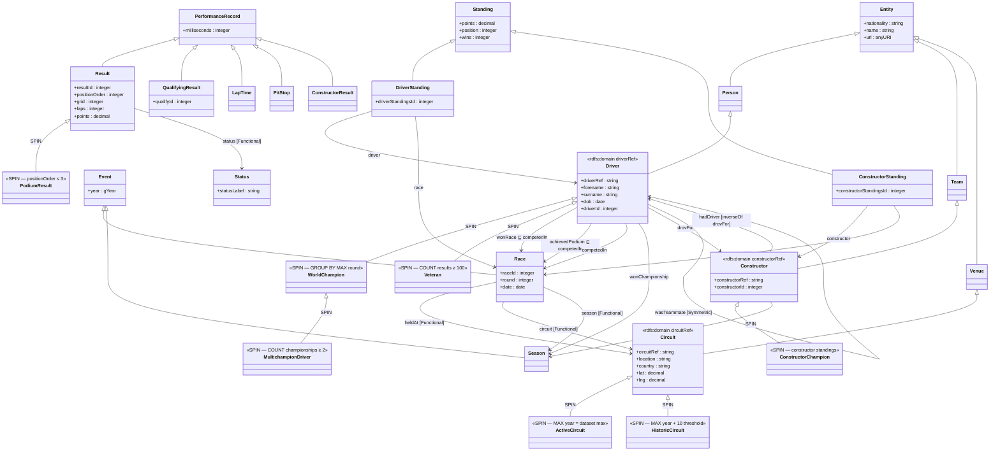

# F1 Knowledge Ontology — RDF/RDFS Diagram

> Rendered with Mermaid `classDiagram`. Requires Mermaid v9+.

## Inference summary

| Mechanism | What it infers |
|---|---|
| `rdfs:domain` of `driverRef` | entity with `driverRef` → `rdf:type Driver` |
| `rdfs:domain` of `constructorRef` | entity → `rdf:type Constructor` |
| `rdfs:domain` of `circuitRef` | entity → `rdf:type Circuit` |
| `owl:equivalentClass` + `someValuesFrom` | bidirectional classification (HermiT) |
| `owl:inverseOf` | `drovFor` triple → `hadDriver` triple materialised |
| `owl:SymmetricProperty` | `wasTeammate` triple → inverse also materialised |
| `rdfs:subPropertyOf` | `wonRace`/`achievedPodium` triples also appear as `competedIn` |
| SPIN rules (14 total) | WorldChampion, Veteran, HistoricCircuit, PodiumResult, etc. |

## Disjointness axioms (`owl:disjointWith`)

- `Driver ⊥ Constructor`
- `Driver ⊥ Circuit`
- `Circuit ⊥ Constructor`
- `Race ⊥ Season`
- `Race ⊥ Driver`
- `Result ⊥ QualifyingResult`
- `Result ⊥ LapTime`
